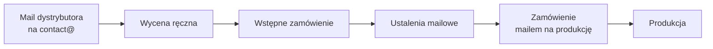
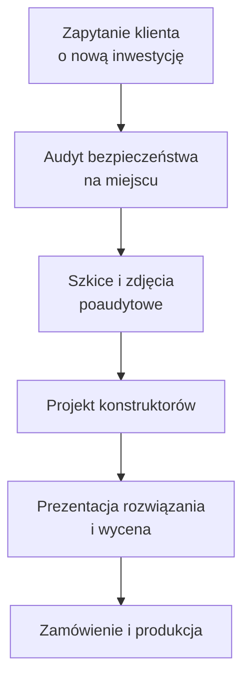
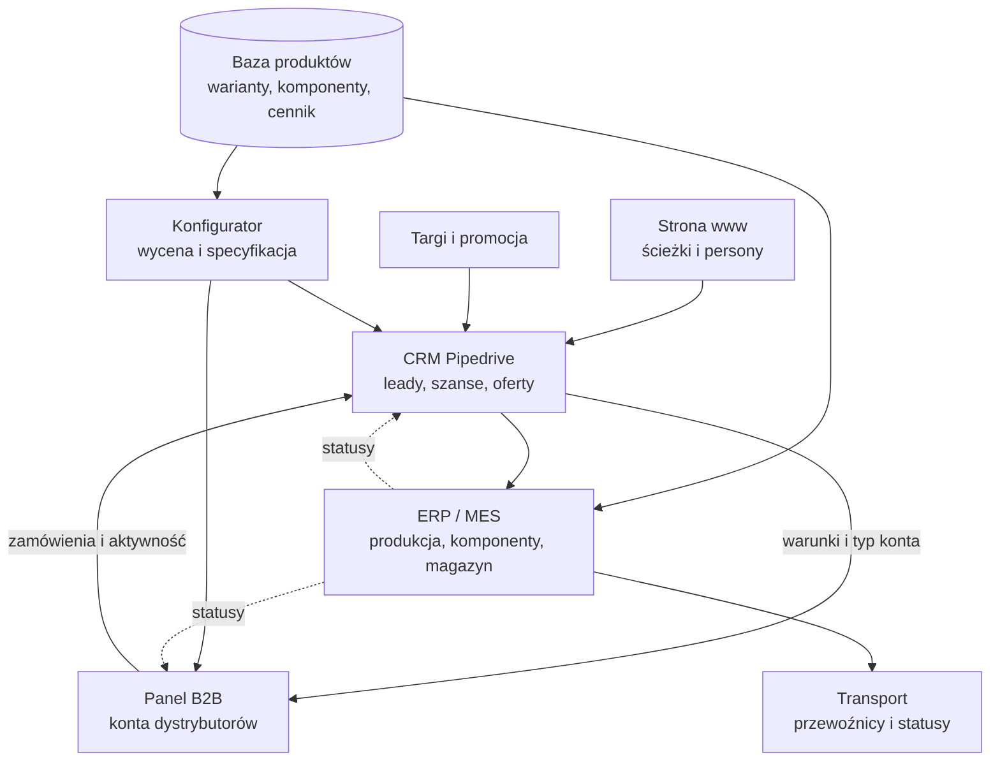
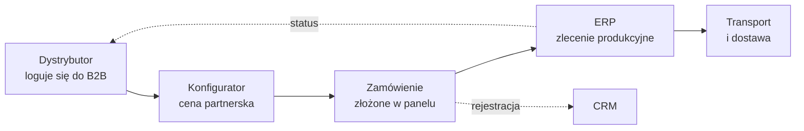
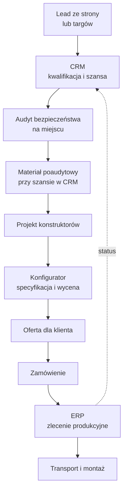
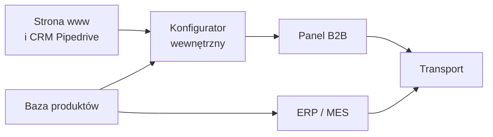

# Anter System: architektura docelowa, od zapytania do dostawy

2026-09-18 · Jakub Zygadło

## Cel dokumentu i zakres

Dokument porządkuje to, jak Anter System obsługuje sprzedaż dzisiaj, i opisuje docelowy krajobraz systemów: stronę www, CRM, bazę produktów, konfigurator, panel B2B, ERP/MES oraz logistykę. Jest punktem wyjścia do rozmowy o zakresie prac i do rozbicia całości na etapy.

Zakres obejmuje:

- dwie ścieżki sprzedaży (dystrybutor i klient końcowy per inwestycja) od pierwszego kontaktu po dostawę,
- role poszczególnych systemów i granice między nimi,
- kierunki integracji i źródła prawdy dla danych,
- kolejność wdrożenia i zależności między elementami.

Poza zakresem na tym etapie: wybór konkretnych dostawców ERP/MES i konfiguratora, wycena wdrożenia, model licencyjny, szczegóły UX interfejsów oraz migracja danych historycznych.

Dokument opisuje stan docelowy, nie zakres pojedynczego sprintu ani demo hackathonowego. Wycinek do zbudowania w pierwszej kolejności wskazuje sekcja o etapach wdrożenia.

## Segmenty klientów i ścieżki wejścia

Anter System obsługuje dwa segmenty o zupełnie różnej charakterystyce zapytania, i to ta różnica wyznacza kształt całego rozwiązania. Dystrybutor generuje dużo drobnych, powtarzalnych tematów. Klient końcowy generuje rzadkie, ale duże i projektowe.

| Wymiar | Dystrybutor | Klient końcowy (inwestycja) |
| --- | --- | --- |
| Kto | Partner z podpisaną umową o współpracy | Firma produkcyjna, magazyn, centrum logistyczne, lotnisko |
| Rynek | Głównie zagraniczne, także polski | Głównie bezpośrednia obsługa |
| Wyzwalacz | Bieżące zapotrzebowanie u jego klienta | Nowa inwestycja: hala, linia produkcyjna, przebudowa |
| Typowe zapytanie | Pojedyncze elementy, bramki, bramy, bariery | Kompleksowa ochrona obiektu, wiele stref naraz |
| Wolumen | Dużo zapytań, często bardzo małych | Mało zapytań, wysoka wartość jednostkowa |
| Wycena | Cennik partnerski z rabatem wg umowy | Wycena projektowa po audycie |
| Cykl | Krótki, powtarzalny | Długi, wieloetapowy |
| Kto po stronie Anter | Obsługa zapytań i wycen | Audytor, konstruktorzy, handlowiec |

Zdarza się, choć rzadko, wariant mieszany: dystrybutor zaprasza Anter System na audyt u swojego klienta i obie strony pracują nad rozwiązaniem wspólnie. Ten przypadek łączy cechy obu ścieżek i nie powinien wymagać osobnego procesu, a jedynie możliwości powiązania szansy sprzedaży z kontem dystrybutora.

Nowa strona www prowadzi zdefiniowane ścieżki marketingowe i buyer persony do jednego punktu wejścia. Docelowo to CRM, a nie skrzynka, rozstrzyga, którym z powyższych torem idzie dany lead.

## Stan obecny

Cały proces od zapytania do produkcji opiera się dziś na poczcie i ręcznej pracy ludzi. Nie ma ERP, nie ma stanów magazynowych, nie ma jednego miejsca, w którym widać status tematu.

**Ścieżka dystrybutora**

Dystrybutor opisuje potrzebę mailem, pracownik liczy wycenę ręcznie, powstaje wstępne zamówienie, a po domknięciu ustaleń trafia ono na produkcję, najczęściej też mailem.

**Ścieżka inwestycyjna**

Tomek jedzie na spotkanie i przeprowadza audyt bezpieczeństwa, w trakcie rysuje na planie i proponuje rozwiązania. Materiał poaudytowy to pliki i zdjęcia. Konstruktorzy projektują na tej podstawie całościowe rozwiązanie dla instalacji: ochrona magazynu, przejścia dla pieszych, dojazdy dla TIR-ów, bariery wewnętrzne i zewnętrzne. Klient dostaje projekt razem z wyceną.

**Systemy w użyciu**

| System | Rola dziś | Ograniczenie |
| --- | --- | --- |
| Skrzynka contact@ | Jedyny kanał zapytań i zamówień | Brak statusu, właściciela, historii per temat |
| IT Cube | Generuje proste zamówienie z produktów w bazie | Tylko proste przypadki, brak konfiguracji złożonych |
| Enova, moduł magazynowy | Kupiony, nieuruchomiony | Wdrożenie nigdy nie zostało dokończone, nikt nie używa |
| Arkusze i wiedza pracowników | Wyceny, warianty, rabaty | Liczone ręcznie, wiedza nieskodyfikowana |

**W toku**

Wdrażana jest nowa strona www obsługująca zdefiniowane ścieżki marketingowe i buyer persony. Kontakt z niej idzie na początku na email. We wrześniu startuje konfiguracja CRM: wybrany został Pipedrive, który ma zebrać leady ze strony, z targów i z pozostałych aktywności promocyjnych oraz rozdzielić je na dystrybutorów i klientów. Wstępny draft konfiguratora jest gotowy.

## Problemy i wąskie gardła

Największy koszt generuje dziś obsługa dużej liczby drobnych zapytań dystrybutorów: każde, nawet najmniejsze, zajmuje pracownika na tyle samo kroków co duże. Reszta problemów wynika z braku wspólnej bazy produktów i braku systemu, który trzymałby stan tematu.

| Problem | Skutek | Co go adresuje |
| --- | --- | --- |
| Każda wycena liczona ręcznie | Czas pracowników, opóźnienia, ryzyko błędu | Baza produktów + konfigurator |
| Dużo drobnych tematów od dystrybutorów | Koszt obsługi nieproporcjonalny do wartości | Panel B2B z samoobsługą |
| Brak jednego rejestru produktów i wariantów | Wiedza w głowach, różne wersje cennika | Baza produktów jako źródło prawdy |
| Proces w mailach | Brak statusu, właściciela i historii tematu | CRM Pipedrive |
| Zamówienie na produkcję mailem | Brak śladu, ryzyko pominięcia zmian | ERP/MES + integracja z CRM |
| Brak stanów magazynowych i komponentów | Terminy szacowane, brak planowania zakupów | ERP/MES, moduł komponentów |
| Materiał poaudytowy w plikach i zdjęciach | Wiedza rozproszona, trudne odtworzenie decyzji | CRM jako repozytorium przy szansie |
| Brak wyceny transportu i statusów wysyłki | Ręczne ustalenia, pytania klientów o „gdzie jest” | Moduł transportowy |
| Enova kupiona, nieuruchomiona | Zamrożony koszt i złudzenie posiadanego systemu | Decyzja: dokończyć albo zastąpić |

Dwa z tych problemów są blokujące dla reszty. Bez bazy produktów nie działa ani konfigurator, ani panel B2B, ani sensowne zamówienie w CRM. Bez rozstrzygnięcia, co jest systemem produkcyjno-magazynowym, nie da się zamknąć pętli statusu z powrotem do sprzedaży.

## Architektura docelowa

Docelowo sześć warstw, z bazą produktów w środku jako elementem, który zasila i konfigurator, i wycenę, i produkcję. CRM prowadzi relację i szansę sprzedaży, ERP prowadzi realizację, panel B2B jest interfejsem dla dystrybutorów.

| Warstwa | Rola | Kto korzysta |
| --- | --- | --- |
| Strona www | Pozyskanie i kwalifikacja wstępna według person | Rynek |
| CRM Pipedrive | Leady, segmentacja, szanse, oferty, historia relacji | Sprzedaż Anter System |
| Baza produktów | Jedno źródło prawdy o produktach, wariantach i cenach | Wszystkie pozostałe warstwy |
| Konfigurator | Złożenie rozwiązania, specyfikacja i wycena | Pracownicy i dystrybutorzy |
| Panel B2B | Samoobsługa dystrybutorów: zamówienia, cennik, wiedza | Dystrybutorzy |
| ERP / MES | Zamówienia produkcyjne, komponenty, magazyn, statusy | Tylko Anter System |
| Transport | Wycena przewozu, zlecenia, śledzenie | Anter System, statusy widoczne dla klienta |

Dwie zasady porządkujące całość. Po pierwsze, ERP jest wyłącznie wewnętrzny: dystrybutor nigdy nie wchodzi do niego bezpośrednio, widzi tylko statusy podane przez panel B2B. Po drugie, każda pozycja, która ma trafić na produkcję, musi pochodzić z bazy produktów, a nie z opisu w mailu.

## Baza produktów

Baza produktów jest fundamentem całego rozwiązania i powinna być osobną warstwą, nie modułem w CRM. Pipedrive potrafi trzymać płaską listę produktów z ceną, ale nie obsłuży wariantów, zależności między elementami, komponentów produkcyjnych ani reguł konfiguracji. Próba zmieszczenia tego w CRM zablokuje później konfigurator i ERP.

**Co musi opisywać rekord produktu**

| Warstwa danych | Zawartość | Odbiorca |
| --- | --- | --- |
| Identyfikacja | Indeks, nazwa, rodzina (bramka, brama, bariera, element) | Wszyscy |
| Atrybuty i warianty | Wymiar, wysokość, rozpiętość, kolor RAL, powłoka, montaż, norma | Konfigurator, oferta |
| Reguły | Dopuszczalne kombinacje, wykluczenia, wartości domyślne, minima i maksima | Konfigurator |
| Akcesoria i zależności | Co jest wymagane, co opcjonalne, co się dobiera automatycznie | Konfigurator |
| Struktura wykonawcza | Lista komponentów i materiałów dla wariantu | ERP / MES |
| Handel | Cena bazowa, waluta, jednostka, grupa rabatowa | Wycena, panel B2B |
| Logistyka | Waga, gabaryt, sposób pakowania, liczba paczek | Wycena transportu |
| Treści | Karta produktu, rysunek, certyfikat, zdjęcia, instrukcja | www, panel B2B, moduł learning |

**Cennik i rabaty**

Cena partnerska powstaje jako cena bazowa pomniejszona o rabat wynikający z umowy dystrybutora. Rabat potrafi różnić się per grupa produktowa i per partner, więc model musi przewidywać grupy rabatowe po stronie produktu i przypisanie warunków po stronie konta. Waluta i rynek wchodzą tu jako osobny wymiar, bo część dystrybutorów działa poza Polską.

**Decyzja do podjęcia**

Gdzie fizycznie mieszka baza produktów: w dedykowanym PIM, w silniku konfiguratora, czy w ERP. Niezależnie od wyboru obowiązuje zasada, że jest jedno miejsce edycji, a pozostałe systemy czytają z niego przez integrację.

## Konfigurator

Konfigurator jest wspólnym narzędziem dla pracowników Anter System i dla dystrybutorów, w jednym silniku i dwóch trybach uprawnień. Wstępny draft jest już gotowy. Różnica między trybami dotyczy widocznych cen, dostępnych odstępstw od reguł i tego, co dzieje się z wynikiem.

| Tryb | Kto | Widzi | Może |
| --- | --- | --- | --- |
| Wewnętrzny | Pracownik Anter System | Cena bazowa, koszt, marża | Wyjść poza standard, wymusić wariant niestandardowy, zmienić rabat |
| Partnerski | Dystrybutor z kontem | Cena partnerska wg swojej umowy | Złożyć konfigurację w ramach reguł, zapisać i zamówić |
| Partnerski bez cen | Dystrybutor z kontem ograniczonym | Specyfikacja bez cen | Złożyć konfigurację i wysłać zapytanie o wycenę |

**Co konfigurator oddaje na wyjściu**

- specyfikację techniczną: lista pozycji z pełnymi wariantami i indeksami z bazy produktów,
- wycenę: cena bazowa, rabat, cena po rabacie, suma, waluta,
- dokument oferty lub zapytania do wysłania albo zapisania,
- dane gotowe do przekazania dalej: do szansy w CRM albo wprost do zamówienia w panelu B2B.

Kluczowe jest to, że wyjście konfiguratora składa się z pozycji istniejących w bazie produktów. Dzięki temu ta sama konfiguracja może bez przepisywania trafić do oferty, do zamówienia i do zlecenia produkcyjnego. Przypadki niestandardowe, których konfigurator nie obsługuje regułami, powinny świadomie wypadać do ścieżki ręcznej z oznaczeniem „do wyceny przez konstruktora”, zamiast blokować całe narzędzie.

W ścieżce inwestycyjnej konfigurator pełni inną rolę niż w ścieżce dystrybutora: nie jest kanałem samoobsługi, tylko narzędziem konstruktora do szybkiego złożenia i wyceny rozwiązania zaprojektowanego po audycie.

## Platforma B2B dla dystrybutorów

Panel B2B ma przejąć obsługę drobnych, powtarzalnych zamówień, które dziś pochłaniają najwięcej czasu pracowników. Dystrybutor loguje się na swoje konto, sam składa konfigurację, widzi swoją cenę i składa zamówienie bez maila.

**Typy kont**

| Typ konta | Cennik | Konfigurator | Zamówienie |
| --- | --- | --- | --- |
| Pełne | Widoczne ceny partnerskie | Tak | Składa bezpośrednio |
| Bez cen | Ceny ukryte | Tak, bez wyceny | Wysyła zapytanie o wycenę |
| Podgląd | Brak cen | Nie | Brak |

Podział wynika z tego, że nie każdy partner ma dostać dostęp do cennika. Więksi dystrybutorzy dostają konto pełne z konfiguratorem i cenami, mniejsi wersję bez cen albo wyłącznie dostęp do materiałów.

**Zakres funkcjonalny**

- konto firmowe z użytkownikami i uprawnieniami po stronie partnera,
- konfigurator z cennikiem partnerskim i zapisem konfiguracji do późniejszego użycia,
- składanie zamówień i historia zamówień z ich statusami,
- dokumenty: oferty, potwierdzenia, faktury, dokumenty przewozowe,
- moduł learning: szkolenia produktowe, karty produktów, rysunki, certyfikaty, materiały marketingowe,
- statusy realizacji i wysyłki, podawane przez ERP i moduł transportowy.

Moduł learning pełni podwójną rolę: obniża liczbę pytań do działu handlowego i podnosi jakość zapytań od partnerów, którzy lepiej rozumieją produkt. Warto powiązać karty produktów bezpośrednio z bazą produktów, żeby treści nie żyły osobnym życiem.

**Informacje zwrotne z panelu B2B do CRM**

Panel nie może być osobną wyspą. Wszystko, co robi w nim partner, wraca do CRM jako zdarzenie przy jego karcie kontrahenta. Bez tego sprzedaż traci widoczność, którą dziś, choć chaotycznie, daje skrzynka mailowa: handlowiec przestaje wiedzieć, kto zamawia, kto przestał i kto się waha.

| Zdarzenie w panelu | Co trafia do CRM | Po co |
| --- | --- | --- |
| Logowanie użytkownika | Data ostatniej aktywności konta i osoby | Wykrycie kont uśpionych |
| Konfiguracja zapisana, niezamówiona | Konfiguracja z wartością i datą | Temat do odzyskania przez opiekuna |
| Zapytanie o wycenę z konta bez cen | Nowa aktywność lub szansa | Przejęcie tematu przez handlowca |
| Zamówienie złożone | Zamówienie, wartość, pozycje | Historia, obrót, realizacja warunków umowy |
| Pobranie karty produktu lub rysunku | Zainteresowanie konkretnym produktem | Sygnał sprzedażowy i temat do rozmowy |
| Ukończone szkolenie w module learning | Postęp szkoleniowy osoby i firmy | Certyfikacja partnera, poziom konta |
| Zgłoszenie lub reklamacja | Sprawa przypisana do opiekuna | Obsługa posprzedażowa |
| Brak aktywności przez ustalony okres | Zadanie dla opiekuna | Reaktywacja partnera |

**Jak to działa**

Panel wysyła zdarzenia do CRM, a kluczem łączącym jest numer kontrahenta, ten sam po obu stronach. Zdarzenia handlowe, czyli zamówienie, zapytanie o wycenę i zgłoszenie, tworzą obiekt w CRM natychmiast. Zdarzenia lekkie, czyli logowania i pobrania plików, są agregowane i podsumowywane, żeby nie zasypać CRM setkami pustych aktywności.

**Co widzi handlowiec na karcie partnera**

- data ostatniego zamówienia i ostatniego logowania,
- obrót narastająco oraz liczba zamówień w okresie,
- porzucone konfiguracje wraz z ich wartością,
- postęp w module learning,
- otwarte zgłoszenia i statusy realizacji.

Na tych danych opierają się automatyzacje w CRM: spadek obrotu względem poprzedniego okresu, brak logowania przez ustaloną liczbę dni, porzucona konfiguracja powyżej progu wartości. Każdy z tych przypadków generuje zadanie dla opiekuna, zamiast czekać na to, że ktoś sam zauważy ciszę ze strony partnera.

**Kierunek odwrotny, z CRM do panelu**

Synchronizacja działa w obie strony. Z CRM do panelu idą dane, które decydują o tym, co partner widzi i może zrobić: warunki handlowe i rabaty, typ konta wraz z widocznością cen, przypisany opiekun, dane do faktur oraz blokada konta w razie przeterminowanych płatności. Dzięki temu zmiana warunków w umowie odbywa się w jednym miejscu i natychmiast obowiązuje w panelu.

## Proces docelowy

Obie ścieżki spotykają się w tym samym miejscu: zamówienie z pozycjami z bazy produktów trafia do ERP i wraca statusem. Różnią się tym, co dzieje się przed zamówieniem.

**Ścieżka dystrybutora, docelowo samoobsługowa**

Temat nietypowy, którego konfigurator nie obsłuży, wypada z tej ścieżki do CRM jako zapytanie o wycenę i wraca do partnera jako oferta. Cel to przesunięcie większości drobnych zamówień do toru samoobsługowego, nie stuprocentowa automatyzacja.

**Ścieżka inwestycyjna**

Różnica wobec dziś polega na trzech rzeczach. Szansa żyje w CRM, a nie w skrzynce. Materiał poaudytowy jest podpięty do szansy, więc konstruktor pracuje na komplecie danych. Wycena powstaje w konfiguratorze na pozycjach z bazy produktów, więc zamówienie i zlecenie produkcyjne są pochodną oferty, a nie osobnym dokumentem pisanym od nowa.

**Segmentacja na wejściu**

Rozdzielenie leada na dystrybutora i klienta końcowego następuje w CRM, na podstawie formularza ze strony, źródła leada i istniejącej umowy partnerskiej. Od tego rozstrzygnięcia zależy dalszy proces, cennik i to, czy partner dostaje konto w panelu B2B.

## ERP, MES i produkcja

ERP jest systemem wyłącznie wewnętrznym. Dystrybutorzy nie mają do niego dostępu, a zapotrzebowanie wchodzi do niego z CRM lub z panelu B2B i wraca na zewnątrz wyłącznie jako status.

**Zakres, który musi obsłużyć**

- przyjęcie zamówienia z pozycjami z bazy produktów i zamiana go na zlecenie produkcyjne,
- rozbicie pozycji na komponenty i materiały według struktury wykonawczej wariantu,
- stany magazynowe komponentów i wyrobów gotowych,
- zapotrzebowanie zakupowe wynikające z braku komponentów,
- harmonogram produkcji i statusy realizacji,
- wydanie do wysyłki i przekazanie do modułu transportowego.

**Statusy zwrotne**

| Status | Widoczny w CRM | Widoczny w panelu B2B |
| --- | --- | --- |
| Zamówienie przyjęte | Tak | Tak |
| W produkcji | Tak | Tak |
| Oczekuje na komponent | Tak | Opcjonalnie, z terminem |
| Gotowe do wysyłki | Tak | Tak |
| Wysłane | Tak | Tak, z numerem przesyłki |
| Dostarczone | Tak | Tak |

**Kwestia Enovy**

Moduł magazynowy Enovy został kupiony, ale nigdy nie został dokończony we wdrożeniu i nikt z niego nie korzysta. Przed wyborem kierunku trzeba rozstrzygnąć trzy rzeczy: jaki dokładnie jest zakres posiadanych licencji, co brakuje do uruchomienia i czy Enova obsłuży produkcję wariantową ze strukturą komponentów, a nie tylko magazyn. Dopiero to pozwala porównać dokończenie wdrożenia z wdrożeniem innego systemu.

Niezależnie od wyboru systemu obowiązuje ta sama zasada: ERP nie przechowuje własnej, równoległej definicji produktu. Czyta strukturę wykonawczą z bazy produktów.

## Logistyka i transport

Moduł transportowy ma zamknąć proces po stronie dostawy: wycenić przewóz już na etapie oferty, zlecić go przewoźnikowi i pokazać status obu stronom. Dziś ten etap jest ustalany ręcznie, a klient pyta o przesyłkę mailem lub telefonicznie.

**Zakres**

- podłączenie przewoźników i ich cenników,
- wycena transportu na podstawie wagi, gabarytu i liczby paczek z bazy produktów oraz adresu dostawy,
- włączenie kosztu transportu do oferty i zamówienia,
- zlecenie przewozu po zwolnieniu towaru przez ERP,
- numer przesyłki i statusy dostawy widoczne w CRM i w panelu B2B,
- dokumenty przewozowe dostępne przy zamówieniu.

**Specyfika produktu**

Bramy, bariery i konstrukcje stalowe są ciężkie i gabarytowe, a część dostaw idzie na rynki zagraniczne. Oznacza to, że wycena transportu rzadko sprowadza się do prostej tabeli stawek: wchodzi tu ładunek niestandardowy, dostawa na plac budowy, rozładunek i czasem montaż. Realistyczne podejście to automatyczna wycena dla przypadków typowych i ręczne zapytanie do spedycji dla reszty, z tą samą logiką co przy konfiguratorze: standard idzie automatem, nietypowe świadomie wypada do człowieka.

## Integracje i przepływ danych

Całość trzyma się jednej zasady: każdy rodzaj danych ma dokładnie jedno miejsce, w którym powstaje i jest edytowany. Pozostałe systemy go czytają. Bez tego rozstrzygnięcia integracje zamienią się w ręczne uzgadnianie rozjechanych danych.

| Dane | Źródło prawdy | Czytają |
| --- | --- | --- |
| Produkty, warianty, reguły, komponenty | Baza produktów | Konfigurator, ERP, panel B2B, www |
| Cennik bazowy | Baza produktów | Konfigurator, panel B2B |
| Warunki handlowe partnera, rabaty, typ konta | CRM | Panel B2B, konfigurator |
| Kontrahenci i kontakty | CRM | Panel B2B, ERP |
| Leady i szanse sprzedaży | CRM | (brak) |
| Oferty i konfiguracje | Konfigurator, zapisane przy szansie w CRM | Panel B2B |
| Aktywność i zdarzenia partnera | Panel B2B | CRM |
| Zamówienia | Panel B2B lub CRM, zależnie od ścieżki | ERP, CRM |
| Zlecenia produkcyjne, stany, statusy | ERP | CRM, panel B2B |
| Przesyłki i statusy dostawy | Moduł transportowy | ERP, CRM, panel B2B |

**Kluczowe identyfikatory**

Spójność między systemami opiera się na kilku identyfikatorach, które muszą być wspólne: indeks produktu z wariantem, numer kontrahenta, numer oferty, numer zamówienia, numer zlecenia produkcyjnego. Warto ustalić je na starcie, zanim powstaną pierwsze integracje.

**Uwaga do Pipedrive**

Pipedrive dobrze poprowadzi lead, szansę i relację handlową. Nie jest natomiast systemem do trzymania złożonej bazy produktowej ani do obsługi zamówień produkcyjnych. Projektując integracje warto z góry założyć, że część produktowa i zamówieniowa żyje poza nim, a w CRM widnieje jako odnośnik i podsumowanie.

## Etapy wdrożenia i zależności

Kolejność wynika z jednej zależności: baza produktów blokuje prawie wszystko inne. Konfigurator, panel B2B i ERP mają sens dopiero wtedy, gdy jest z czego składać zamówienie.

| Etap | Zakres | Warunek wejścia | Efekt |
| --- | --- | --- | --- |
| 0 | Strona www, CRM Pipedrive, segmentacja leadów | W toku | Koniec obsługi sprzedaży w skrzynce |
| 1 | Baza produktów: model danych, warianty, reguły, cennik | Decyzja, gdzie mieszka | Fundament dla reszty |
| 2 | Konfigurator w trybie wewnętrznym | Etap 1 | Wyceny liczone szybciej i spójnie |
| 3 | Panel B2B: konta, cennik, zamówienia | Etap 2 | Drobne zamówienia schodzą z pracowników |
| 4 | ERP / MES: komponenty, zlecenia, statusy | Etap 1, decyzja o Enovie | Produkcja i magazyn pod kontrolą |
| 5 | Moduł transportowy | Etap 4 | Zamknięcie procesu do dostawy |
| 6 | Moduł learning w panelu B2B | Etap 3 | Mniej pytań, lepsze zapytania partnerów |

**Co można robić równolegle**

Etap 0 idzie niezależnie od etapu 1 i nie musi na niego czekać. Analizę Enovy i wybór kierunku ERP można prowadzić równolegle do prac nad bazą produktów, bo jej wynik jest potrzebny dopiero na etapie 4. Moduł learning nie blokuje niczego i może powstawać stopniowo.

**Gdzie jest największy zwrot na start**

Etapy 1 i 2 razem odbierają największą część obecnego kosztu, czyli ręczne liczenie wycen, i jednocześnie odblokowują wszystkie pozostałe elementy. Etap 3 zamienia ten fundament w realną oszczędność czasu, bo przenosi drobne zamówienia na stronę partnera.

## Pytania otwarte

Sześć rozstrzygnięć warunkuje kształt reszty. Trzy pierwsze blokują start prac technicznych.

| Pytanie | Dlaczego ważne | Kto rozstrzyga |
| --- | --- | --- |
| Gdzie mieszka baza produktów: PIM, konfigurator czy ERP | Przesądza o architekturze integracji | Zarząd i IT |
| Dokończyć Enovę czy wdrożyć inny ERP/MES | Warunkuje etap 4 i budżet | Zarząd, po analizie licencji |
| Ile produktów i wariantów realnie trzeba opisać na start | Decyduje o pracochłonności etapu 1 | Konstruktorzy i sprzedaż |
| Konfigurator własny czy gotowy silnik | Wpływa na koszt, tempo i granice reguł | IT i zarząd |
| Ilu dystrybutorów dostanie konto pełne z cenami | Wpływa na zakres panelu B2B i politykę cenową | Sprzedaż |
| Jak traktować przypadki niestandardowe w wycenie | Wyznacza granicę automatyzacji | Sprzedaż i konstruktorzy |

**Rzeczy do doprecyzowania przed projektowaniem**

- struktura rabatów: czy są per partner, per grupa produktowa, czy mieszane,
- waluty i rynki obsługiwane przez cennik partnerski,
- czy montaż i usługi mają być pozycjami wycenianymi w konfiguratorze,
- jak wygląda dziś obieg akceptacji oferty i czy ma się zmienić,
- co dokładnie potrafi IT Cube i czy zostaje w architekturze docelowej,
- jakie dane historyczne o zamówieniach i partnerach trzeba przenieść.
